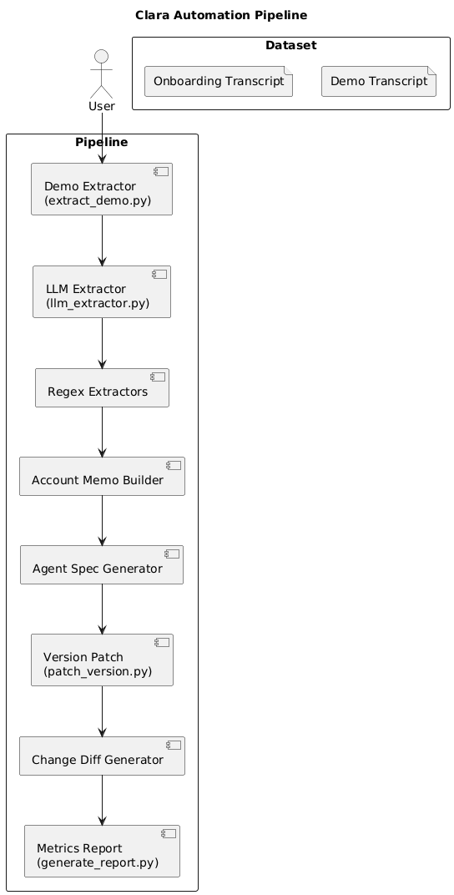
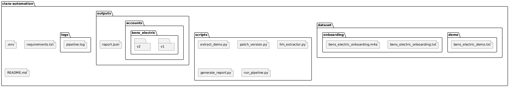

# Clara AI Automation Pipeline


Automation pipeline for extracting AI call agent configuration from demo and onboarding transcripts.

## Overview
- This project implements an automation pipeline that simulates Clara’s internal onboarding workflow for configuring AI call agents for commercial customers.
- The system processes two types of call transcripts:
  - Demo Call Transcript
  - Onboarding Call Transcript
- The automation extracts operational configuration from transcripts and produces structured outputs used to configure an AI call agent.
- The pipeline generates versioned configurations to reflect the progression from a demo discussion to a finalized onboarding setup.

---

# Objectives
- Automatically extract structured configuration from call transcripts.
- Generate an **Account Memo** containing operational details.
- Generate a **Retell Agent Draft Specification** for the AI voice agent.
- Track configuration changes between demo and onboarding calls.
- Produce a structured **change log** describing what changed between versions.

---

---
## Architecture Diagram

 

## Project Structure



# Workflow

## Stage 1: Demo Call Processing
- The demo call transcript is analyzed to extract initial operational configuration.
- The system generates the first version of the account configuration.

Outputs generated:
- `memo.json` (Account Memo v1)
- `agent_spec.json` (Agent Draft Spec v1)

---

## Stage 2: Onboarding Call Processing
- The onboarding call transcript is analyzed to confirm or refine operational configuration.
- The system compares onboarding information with the demo configuration.

Outputs generated:
- Updated `memo.json` (v2)
- Updated `agent_spec.json` (v2)
- `changes.json` describing configuration differences

---

## Stage 3: Reporting
- After processing all accounts, the system generates a report summarizing pipeline execution.

Outputs generated:
- `report.json`

---

# Dataset Format

The system expects transcripts to follow a specific naming convention.

Demo transcripts:
<account_id>_demo.txt


Onboarding transcripts:

<account_id>_onboarding.txt


Example dataset structure:

```
dataset/
├── demo/
│   └── bens_electric_demo.txt
│
└── onboarding/
    ├── bens_electric_onboarding.txt
    └── bens_electric_onboarding.m4a
```

Notes:
- Only `.txt` files are used by the pipeline.
- Audio files are optional and ignored during processing.

---

## Output Structure

After running the pipeline, results are stored under the `outputs` directory.

```
outputs/
├── accounts/
│   └── bens_electric/
│       ├── v1/
│       │   ├── memo.json
│       │   └── agent_spec.json
│       │
│       └── v2/
│           ├── memo.json
│           ├── agent_spec.json
│           └── changes.json
│
└── report.json
```


---

# Account Memo

The Account Memo captures structured configuration extracted from transcripts.

Example structure:

{
"account_id": "bens_electric",
"company_name": "Ben's Electric",
"business_hours": {},
"services_supported": ["electrical"],
"emergency_routing_rules": {},
"non_emergency_routing_rules": {},
"call_transfer_rules": {},
"questions_or_unknowns": [],
"confidence_level": "medium"
}


Purpose:
- Provide a structured representation of operational rules discussed during calls.
- Serve as the foundation for generating agent configuration.

---

# Agent Specification

The system generates a draft configuration for an AI call agent.

The specification includes:
- Agent name
- Voice style
- System prompt
- Business logic for call handling
- Transfer handling rules
- Version identifier

Purpose:
- Provide a starting configuration for deploying the AI call agent.

---

# Change Tracking

The system tracks differences between configuration versions.

Example change log structure:

{
"stage": "onboarding_update",
"summary": "Onboarding updated metadata and clarification notes only.",
"changes_detected": [
"questions_or_unknowns",
"notes"
]
}


Purpose:
- Highlight configuration updates between demo and onboarding stages.
- Provide transparency into configuration evolution.

---

# Running the Pipeline

## Step 1: Create Python Environment

python -m venv venv


Activate the environment:
venv\Scripts\activate

---

## Step 2: Install Dependencies
pip install -r requirements.txt


---

## Step 3: Configure Optional API Key

Create a `.env` file if LLM extraction is enabled.

GROQ_API_KEY=your_api_key_here


If no API key is provided:
- The pipeline falls back to regex-based extraction.

---

## Step 4: Execute the Pipeline

Run the automation pipeline:


python -m scripts.run_pipeline


The pipeline executes the following stages:

DEMO_V1
ONBOARDING_V2
REPORT


---

# Pipeline Report

After execution, the system produces a summary report.

Example:


{
"accounts_processed": 1,
"v1_generated": 1,
"v2_generated": 1,
"unknown_fields_detected": 2,
"confidence_levels": {
"medium": 1
}
}


Purpose:
- Provide high-level insight into pipeline results.
- Track configuration completeness and extraction confidence.

---

# Reliability Features

## Hybrid Extraction
- The system combines multiple extraction techniques:
  - LLM-assisted extraction
  - Structured validation
  - Regex fallback logic

This ensures stable behavior even if one method fails.

---

## Idempotent Pipeline
- Running the pipeline multiple times does not overwrite existing outputs.

Example log behavior:


v1 already exists — skipping
v2 already exists — skipping


---

## Unknown Detection
- When information is not present in transcripts, the system records it under:


questions_or_unknowns


This prevents the system from guessing or hallucinating missing configuration.

---

# Limitations

- Some configuration fields may remain empty if they are not mentioned in transcripts:
  - business hours
  - emergency definitions
  - office address

- The system intentionally avoids inferring missing information to maintain accuracy.

---

# Future Improvements

Possible enhancements include:
- Improved semantic extraction for company names and business hours
- Support for multiple accounts within a single dataset
- More advanced transcript parsing
- Integration with voice agent deployment APIs
- Improved reporting and monitoring capabilities

---

# Conclusion

This project demonstrates a complete automation pipeline capable of:

- Extracting structured operational configuration from conversations
- Generating AI call agent specifications
- Tracking configuration updates across onboarding stages
- Producing reproducible, versioned outputs

The system mirrors the operational workflow used by AI voice platforms when configuring new customers.
